# Newsletter GPT Migration Plan

## Overview
Transform from Zapier-based immediate processing to automated daily ingestion + weekly digest system with smart filtering and batch processing.

**Current:** Email → Zapier → OpenAI → Notion (individual summaries)  
**Target:** Daily Email Ingestion → SQLite Storage → Weekly Digest Generation → Notion (weekly digest)

## Architecture Overview

```mermaid
graph TD
    A[⏰ Daily Scheduler] -->|8 PM Daily| B[Email Daily Processor]
    C[⏰ Weekly Scheduler] -->|Sunday 7 AM| D[Weekly Digest Generator]
    
    B -->|IMAP Fetch| E[📧 Email Servers]
    B -->|Primitive Filter| F[Potential Newsletters]
    F -->|Batch Processor| G[LLM Batch Analysis]
    G -->|10 newsletters/call| H[Summary + Genre]
    H --> I[📊 SQLite Database]
    
    D -->|Query Last 7 Days| I
    D --> J[Genre Grouping]
    J --> K[Unified Summaries]
    K --> L[📄 Weekly Digest]
    L --> M[Notion Integration]
    
    N[👤 User] --> M
    
    style A fill:#fff3e0
    style C fill:#e8f5e8
    style B fill:#e1f5fe
    style D fill:#e8f5e8
    style I fill:#f3e5f5
    style G fill:#fff8e1
    style M fill:#fce4ec
```



### Key Innovations:
- **Daily + Weekly System**: Daily ingestion with weekly digest generation
- **Batch Processing**: 10 newsletters per LLM call for efficiency
- **SQLite Storage**: Persistent storage with Langchain Document objects
- **Genre Classification**: 15 approved genres for organized digests
- **Rate Limiting**: Smart batching with retry logic to handle API limits

---

## Phase 1: Foundation & Modularization

### Task 1.1: OpenRouter Integration ✅
**Goal:** Replace OpenAI with free Gemini model

- [x] Update OpenAI client to use OpenRouter endpoint
- [x] Test basic chat completion with Gemini
- [x] Create simple wrapper function

### Task 1.2: Email Processing Modules ✅
**Goal:** Atomic email processing components

- [x] Create `email_processing/` module with:
  - [x] `imap_connector.py` - IMAP connections
  - [x] `email_searcher.py` - Email searching by date
  - [x] `email_parser.py` - Email content parsing
  - [x] `email_fetcher.py` - Main orchestrator

### Task 1.3: Processing Modules ✅
**Goal:** Modular newsletter processing components

- [x] Create `processors/` module with:
  - [x] `email_filters.py` - Primitive filtering
  - [x] `newsletter_identifier.py` - LLM identification
  - [x] `content_cleaner.py` - Content cleaning
  - [x] `summary_generator.py` - Summary generation
  - [x] `digest_formatter.py` - Weekly digest formatting

---

## Phase 2: Daily Processing System

### Task 2.1: Database Infrastructure
**Goal:** SQLite storage with Langchain Document objects

- [ ] Create `SQLiteManager` for database operations
- [ ] Design newsletter schema with genre classification
- [ ] Implement Langchain Document storage and retrieval
- [ ] Add proper indexing for date, genre, and source queries

### Task 2.2: Batch Processing Engine
**Goal:** Efficient LLM processing with rate limiting

- [ ] Create `BatchProcessor` with configurable batch sizes
- [ ] Implement rate limiting (1 hour between batches, 10-minute retries)
- [ ] Structured JSON output for clean data extraction
- [ ] Error handling and logging for batch failures

### Task 2.3: Email Daily Processor
**Goal:** Daily email ingestion system

- [ ] Create `EmailDailyProcessor` for 24-hour email fetching
- [ ] Integrate primitive filtering with unsubscribe detection
- [ ] Batch process newsletters (10 per LLM call)
- [ ] Store processed newsletters in SQLite with genre classification
- [ ] Schedule daily processing at 8 PM

**Test:** `python email_daily_processor.py --test-batch`

---

## Phase 3: Weekly Digest System

### Task 3.1: Weekly Digest Generator
**Goal:** Generate comprehensive weekly digests from SQLite data

- [ ] Create `WeeklyDigestGenerator` to query last 7 days
- [ ] Group newsletters by genre for organized sections
- [ ] Generate unified summaries for each genre
- [ ] Create comprehensive weekly digest format
- [ ] Include metadata (source count, date range, total newsletters)

### Task 3.2: Langchain Document Manager
**Goal:** Efficient document storage and retrieval

- [ ] Create `LangchainDocumentManager` for document operations
- [ ] Implement document creation with proper metadata
- [ ] Add query capabilities for date ranges and genres
- [ ] Optimize for weekly digest generation workflows

### Task 3.3: Scheduling Integration
**Goal:** Coordinate daily and weekly processes

- [ ] Setup APScheduler with dual schedules:
  - [ ] Daily processing at 8 PM
  - [ ] Weekly digest generation on Sunday 7 AM
- [ ] Add comprehensive logging for both processes
- [ ] Handle errors gracefully with email notifications
- [ ] Prevent overlapping processes

**Test:** `python weekly_digest_generator.py --test-last-week`

---

## Phase 4: Integration & Deployment

### Task 4.1: Notion Integration
**Goal:** Create beautiful weekly digest pages in Notion

- [ ] Integrate with Notion API for weekly digests
- [ ] Rich text formatting with genre sections
- [ ] Include source newsletter names and links
- [ ] Add week date range headers and statistics
- [ ] Error handling for API limits and retries

### Task 4.2: Configuration & Rate Limiting
**Goal:** Production-ready configuration

- [ ] Create configuration management system
- [ ] Implement batch processing configuration:
  - [ ] BATCH_SIZE = 10 newsletters per LLM call
  - [ ] BATCH_INTERVAL = 3600 seconds (1 hour)
  - [ ] RETRY_ATTEMPTS = 3 with 600-second intervals
- [ ] Add environment-specific settings
- [ ] Database backup and recovery procedures

### Task 4.3: Final Integration
**Goal:** Complete automated system

- [ ] Integrate all components into unified system
- [ ] Create startup and monitoring scripts
- [ ] Test end-to-end daily + weekly workflow
- [ ] Deploy with proper error handling and alerting

**Test:** `python run.py --test-full-cycle && python run.py --start`

---

## Quick Start Commands

```bash
# Setup
pip install openai beautifulsoup4 apscheduler requests langchain sqlite3
cp config_example.py config.py
# Edit config.py with your credentials

# Initialize database
python -c "from database.sqlite_manager import SQLiteManager; SQLiteManager().create_tables()"

# Test components
python email_processing/email_fetcher.py --test
python processors/batch_processor.py --test-batch
python email_daily_processor.py --test-batch
python weekly_digest_generator.py --test-last-week

# Test full workflow
python run.py --test-full-cycle

# Start daily + weekly automation
python run.py --start
```

## Database Schema

```sql
CREATE TABLE newsletters (
    id INTEGER PRIMARY KEY AUTOINCREMENT,
    date DATE NOT NULL,
    sender TEXT NOT NULL,
    subject TEXT NOT NULL,
    summary TEXT NOT NULL,
    source TEXT NOT NULL,
    genre TEXT NOT NULL,
    word_count INTEGER NOT NULL,
    created_at TIMESTAMP DEFAULT CURRENT_TIMESTAMP
);

CREATE INDEX idx_newsletters_date ON newsletters(date);
CREATE INDEX idx_newsletters_genre ON newsletters(genre);
CREATE INDEX idx_newsletters_source ON newsletters(source);
```

## Approved Genres

Technology, Business, Philosophy, Culture, Science, Health, Productivity, Writing & Creativity, Personal Growth, Finance, Politics, Education, Lifestyle, Humor & Entertainment, Spirituality

## Rate Limiting Configuration

```python
# Batch Configuration
BATCH_SIZE = 10  # newsletters in the prompt per LLM call
BATCH_INTERVAL = 3600  # 1 hour between batches (seconds)
RETRY_ATTEMPTS = 3  # retries per failed call
RETRY_INTERVAL = 600  # 10 minutes between retries (seconds)
```
