# Newsletter GPT Migration Plan

## Overview
Transform from Zapier-based immediate processing to automated weekly digest system with smart filtering.

**Current:** Email → Zapier → OpenAI → Notion (individual summaries)  
**Target:** Email Collection → Weekly LLM Filtering → Summarization → Notion (weekly digest)

## Architecture Overview

```mermaid
graph TD
    A[⏰ APScheduler] -->|Sunday 8 PM| B[Weekly Processor]
    
    B -->|IMAP Fetch| C[📧 Email Servers]
    B -->|Primitive Filter| D[Potential Newsletters]
    D -->|LLM Subject Filter| E[Final Newsletters]
    E --> F[Content Cleaner]
    F --> G[LLM Summarizer] 
    G --> H[📄 Notion Pages]
    
    I[👤 User] --> H
    
    style A fill:#fff3e0
    style C fill:#e1f5fe
    style B fill:#e8f5e8
    style H fill:#fce4ec
```



### Key Innovation:
- **Smart Two-Phase Filtering**: Primitive filtering + LLM subject filtering (weekly)
- **Single Weekly Job**: Collect and process in one session (no intermediate storage)

---

## Phase 1: Foundation

### Task 1.1: OpenRouter Integration
**Goal:** Replace OpenAI with free DeepSeek model

- [x] Update OpenAI client to use OpenRouter endpoint
- [x] Test basic chat completion with DeepSeek
- [x] Create simple wrapper function

**Test:** `python -c "from openai import OpenAI; client = OpenAI(base_url='https://openrouter.ai/api/v1', api_key='key'); print('Working!')"`

### Task 1.2: Simple Email Fetcher
**Goal:** Basic IMAP email collection for weekly processing

- [x] Create IMAP email fetcher (basic connection and fetch)
- [x] Fetch emails from past 7 days only
- [x] Basic error handling for connection issues

**Test:** `python email_fetcher.py --test`

---

## Phase 2: Weekly Processing

### Task 2.1: Complete Weekly Processor
**Goal:** Single job that fetches, filters, and summarizes

- [x] Fetch emails from past 7 days via IMAP
- [x] Apply primitive filtering (unsubscribe detection)
- [x] Send filtered subjects (and first 3 semantic lines) to LLM for newsletter identification
- [x] Clean content of confirmed newsletters
- [x] Generate individual summaries with LLM
- [x] Combine into weekly digest format
- [x] **BONUS:** Modularized into atomic components (email_processing/, processors/)
- [x] **BONUS:** Creates actual digest files in digests/ directory

**Reference:** DATA_PREPROCESSING.md

**Test:** `python weekly_processor.py --dry-run`

### Task 2.2: Scheduling
**Goal:** Automate weekly processing

- [ ] Setup APScheduler for single weekly job (Sunday 8 PM)
- [ ] Add comprehensive logging
- [ ] Handle errors gracefully (continue on failures)

**Test:** `python scheduler.py --test-mode`

---

## Phase 3: Integration

### Task 3.1: Notion Integration
**Goal:** Create beautiful weekly digest pages to be sent to Notion

- [ ] Integrate with Notion
- [ ] Rich text formatting for weekly digests
- [ ] Section headers by topic/theme
- [ ] Include source newsletter names and links
- [ ] Add week date range headers
- [ ] Error handling for API limits

**Test:** `python notion_client.py --test-weekly-digest`

### Task 3.2: Final Integration
**Goal:** Complete automated system

- [ ] Integrate all components into single runner
- [ ] Create simple startup script
- [ ] Test end-to-end weekly workflow

**Test:** `python run.py --test && python run.py --start`

---

## Quick Start Commands

```bash
# Setup
pip install openai beautifulsoup4 apscheduler requests
cp config_example.py config.py
# Edit config.py with your credentials

# Test components
python email_fetcher.py --test
python weekly_processor.py --dry-run
python notion_client.py --test

# Start weekly automation
python run.py --start
```
