# Newsletter GPT Migration Plan - Simplified

## Overview
Transform from Zapier-based immediate processing to weekly digest system with free DeepSeek model.

**Current:** Email → Zapier → OpenAI → Notion (individual summaries)  
**Target:** Email Collection → Weekly Digest → DeepSeek → Notion (comprehensive weekly read)

## Architecture Overview

```mermaid
graph TD
    A[⏰ APScheduler] -->|Every 2hrs| B[Email Collector]
    A -->|Sunday 8 PM| E[Weekly Processor]
    
    B -->|IMAP Fetch| C[📧 Email Servers]
    B --> D[(SQLite Database)]
    
    D --> E
    E --> F[Data Cleaner]
    F --> G[LLM]
    G --> H[Weekly Digest]
    H --> I[📄 Notion Pages]
    
    J[👤 User] --> I
    
    style A fill:#fff3e0
    style C fill:#e1f5fe
    style D fill:#f3e5f5
    style G fill:#e8f5e8
    style I fill:#fce4ec
```



### Key Components:
- **📧 Email Collection**: IMAP-based, runs every 2 hours via APScheduler
- **📊 Storage**: Simple SQLite database for newsletter data
- **⏰ Scheduling**: APScheduler for automated collection & weekly processing  
- **🤖 AI Processing**: Free DeepSeek model via OpenRouter for cost-effective summaries
- **📄 Output**: Rich weekly digest pages in Notion
- **🖥️ Backend**: FastAPI server facilitating the workflow

---

## Phase 1: Core Foundation (Essential)

### Task 1.1: OpenRouter Integration
**Goal:** Replace OpenAI with free DeepSeek model

- [ ] Update OpenAI client to use OpenRouter endpoint
- [ ] Test basic chat completion with DeepSeek
- [ ] Update existing summary functions

**Test:** `python -c "from openai import OpenAI; client = OpenAI(base_url='https://openrouter.ai/api/v1', api_key='key'); print('Working!')"`

### Task 1.2: Simple Database
**Goal:** Local storage for newsletters

- [ ] Create SQLite database with single table (id, sender, content, date, processed)
- [ ] Add basic save/retrieve functions
- [ ] Test with sample data

**Test:** `python -c "from database import save_newsletter, get_newsletters; save_newsletter('test'); print(len(get_newsletters()))"`

### Task 1.3: Email Collection
**Goal:** Replace Zapier with IMAP

- [ ] Create simple IMAP email fetcher
- [ ] Add robust newsletter filtering
- [ ] Store newsletters in database
- [ ] Prevent duplicates

**Test:** `python email_collector.py --dry-run`

---

## Phase 2: Weekly Processing (Core Value)

### Task 2.1: Better Text Processing
**Goal:** Clean newsletter content properly

- [ ] HTML cleaning function
- [ ] Remove email signatures/footers
- [ ] Basic content validation
- [ ] Extract key topics and themes

**Test:** `python -c "from text_utils import clean_content; print(clean_content('<html>test</html>'))"`

### Task 2.2: Weekly Digest Processor
**Goal:** Process all newsletters from a week into engaging summary

- [ ] Group newsletters by week (Monday-Sunday)
- [ ] Generate individual newsletter summaries with DeepSeek
- [ ] Identify common themes across the week
- [ ] Create engaging weekly digest format
- [ ] Add newsletter source attribution

**Test:** `python weekly_processor.py --week current --dry-run`

### Task 2.3: Automated Scheduling
**Goal:** Run collection and processing automatically

- [ ] Simple cron-like scheduler (APScheduler)
- [ ] Email collection every 2 hours (less frequent)
- [ ] Weekly processing every Sunday at 8 PM
- [ ] Basic logging

**Test:** `python scheduler.py --test-mode`

---

## Phase 3: Integration (Polish)

### Task 3.1: Enhanced Notion Pages
**Goal:** Engaging weekly digest format

- [ ] Rich text formatting for weekly digests
- [ ] Section headers by topic/theme
- [ ] Include source newsletter names and links
- [ ] Add week date range headers (e.g., "Week of Jan 15-21, 2024")
- [ ] Reading time estimates
- [ ] Error handling for API limits

**Test:** `python notion_client.py --test-weekly-digest`

### Task 3.2: Simple Control Panel
**Goal:** Basic monitoring and manual controls

- [ ] Health check endpoint
- [ ] Manual trigger endpoints
- [ ] Simple status page
- [ ] Basic metrics

**Test:** `curl localhost:8000/health`

### Task 3.3: Configuration
**Goal:** Easy setup and configuration

- [ ] Single config file for all settings
- [ ] Environment variable validation
- [ ] Default values for personal use

**Test:** `python -c "from config import load_config; print(load_config())"`

---

## Quick Start Commands

```bash
# Phase 1 - Foundation
pip install openai sqlite3
python -c "from openai import OpenAI; print('OpenAI installed')"
python database.py --init
python email_collector.py --test

# Phase 2 - Weekly Processing  
python weekly_processor.py --test
python scheduler.py --test

# Phase 3 - Integration
python notion_client.py --test
uvicorn main:app --reload
```
