# Newsletter GPT Migration Plan

## Overview
Transform from Zapier-based immediate processing to automated daily ingestion + weekly digest system with smart filtering and batch processing.

**Current:** Email → Zapier → OpenAI → Notion (individual summaries)  
**Target:** Daily Email Ingestion → SQLite Storage → Weekly Digest Generation → Notion (weekly digest)

## Architecture Overview

```mermaid
graph TD
    A[⏰ Daily Scheduler] -->|8 PM Daily| B[Email Daily Processor]
    C[⏰ Weekly Scheduler] -->|Sunday 7 AM| D[Weekly Digest Generator]
    
    B -->|IMAP Fetch| E[📧 Email Servers]
    B -->|Primitive Filter| F[Potential Newsletters]
    F -->|Batch Processor| G[LLM Batch Analysis]
    G -->|10 newsletters/call| H[Summary + Genre]
    H --> I[📊 SQLite Database]
    
    D -->|Query Last 7 Days| I
    D --> L[📄 Weekly Digest]
    L --> M[Notion Integration]
    
    N[👤 User] --> M
    
    style A fill:#fff3e0
    style C fill:#e8f5e8
    style B fill:#e1f5fe
    style D fill:#e8f5e8
    style I fill:#f3e5f5
    style G fill:#fff8e1
    style M fill:#fce4ec
```



### Key Innovations:
- **Daily + Weekly System**: Daily ingestion with weekly digest generation
- **Batch Processing**: 10 newsletters per LLM call for efficiency
- **SQLite Storage**: Persistent storage with Langchain Document objects
- **Genre Classification**: 15 approved genres for organized digests
- **Rate Limiting**: Smart batching with retry logic to handle API limits

---

## Phase 1: Foundation & Modularization

### Task 1.1: OpenRouter Integration ✅
**Goal:** Replace OpenAI with free Gemini model

- [x] Update OpenAI client to use OpenRouter endpoint
- [x] Test basic chat completion with Gemini
- [x] Create simple wrapper function

### Task 1.2: Email Processing Modules ✅
**Goal:** Atomic email processing components

- [x] Create `email_processing/` module with:
  - [x] `imap_connector.py` - IMAP connections
  - [x] `email_searcher.py` - Email searching by date
  - [x] `email_parser.py` - Email content parsing
  - [x] `email_fetcher.py` - Main orchestrator

### Task 1.3: Processing Modules ✅
**Goal:** Modular newsletter processing components

- [x] Create `processors/` module with:
  - [x] `email_filters.py` - Primitive filtering
  - [x] `content_cleaner.py` - Content cleaning
  - [x] `summary_generator.py` - Summary generation
  - [x] `digest_formatter.py` - Weekly digest formatting

---

## Phase 2: Daily Processing System ✅ COMPLETE

### Task 2.1: Database Infrastructure ✅ COMPLETE
**Goal:** SQLite storage with Document objects

- [x] Create `SQLiteManager` for database operations ✅
- [x] Design newsletter schema with genre classification ✅
- [x] Implement Document storage and retrieval ✅
- [x] Add proper indexing for date, genre queries ✅

**Implemented:** `processors/sqlite_manager.py` with full database operations, exact schema from Generation Engine spec, and Document object creation.

### Task 2.2: Batch Processing Engine ✅ COMPLETE
**Goal:** Efficient LLM processing with rate limiting

- [x] Create `BatchProcessor` with configurable batch sizes ✅
- [x] Implement rate limiting (1 hour between batches, 10-minute retries) ✅
- [x] Structured JSON output for clean data extraction ✅
- [x] Error handling and logging for batch failures ✅

**Implemented:** `processors/batch_processor.py` with exact batch configuration from Generation Engine spec and comprehensive error handling.

### Task 2.3: Email Daily Processor ✅ COMPLETE
**Goal:** Daily email ingestion system

- [x] Create `EmailDailyProcessor` for 24-hour email fetching ✅
- [x] Integrate primitive filtering with unsubscribe detection ✅
- [x] Batch process newsletters (10 per LLM call) ✅
- [x] Store processed newsletters in SQLite with genre classification ✅
- [x] Create `DailyNewsletterProcessor` integration ✅

**Implemented:** Complete Phase 1 from Generation Engine spec with `processors/email_daily_processor.py`, `processors/content_processor.py`, and `processors/daily_newsletter_processor.py`.

**Test:** `python processors/daily_newsletter_processor.py` ✅ WORKING

---

## Phase 3: Weekly Digest System ✅ COMPLETE

### Task 3.1: Weekly Digest Generator ✅ COMPLETE
**Goal:** Generate comprehensive weekly digests from SQLite data

- [x] Create `WeeklyDigestGenerator` to query last 7 days ✅
- [x] Group newsletters by genre for organized sections ✅
- [x] Generate unified summaries for each genre ✅
- [x] Create comprehensive weekly digest format ✅
- [x] Include metadata (date range, total newsletters) ✅
- [x] Implement rate limiting for API compliance ✅

**Implemented:** `processors/weekly_digest_generator.py` with sophisticated rate limiting (15 min between genres, 5 min retry intervals) and comprehensive digest generation.

### Task 3.2: Weekly Data Extraction ✅ COMPLETE
**Goal:** Efficient document storage and retrieval

- [x] Create `WeeklyDataExtractor` for document operations ✅
- [x] Implement document creation with proper metadata ✅
- [x] Add query capabilities for date ranges and genres ✅
- [x] Optimize for weekly digest generation workflows ✅

**Implemented:** `processors/weekly_data_extractor.py` with genre-based data grouping and Document object management.

### Task 3.3: Centralized Configuration ✅ COMPLETE
**Goal:** Centralized configuration management

- [x] Create `config.py` with all configurable parameters ✅
- [x] Implement batch processing configuration ✅
- [x] Add weekly digest rate limiting configuration ✅
- [x] Test mode support for development ✅

**Implemented:** Complete centralized configuration in `config.py` with all Generation Engine specifications and rate limiting parameters.

**Test:** `python processors/weekly_digest_generator.py` ✅ WORKING

---

## Phase 4: Integration & Deployment

### Task 4.1: Scheduler Automation
**Goal:** Automated daily and weekly processing

- [ ] Setup APScheduler with dual schedules:
  - [ ] Daily processing at 8 PM
  - [ ] Weekly digest generation on Sunday 7 AM
- [ ] Add comprehensive logging for both processes
- [ ] Handle errors gracefully with notifications
- [ ] Prevent overlapping processes

**Status:** All components ready, need scheduler implementation

### Task 4.2: Notion Integration
**Goal:** Create beautiful weekly digest pages in Notion

- [ ] Integrate with Notion API for weekly digests
- [ ] Rich text formatting with genre sections
- [ ] Include source newsletter names and links
- [ ] Add week date range headers and statistics
- [ ] Error handling for API limits and retries

**Status:** Optional integration for publishing digests

### Task 4.3: Production Deployment
**Goal:** Production-ready deployment

- [ ] Create startup and monitoring scripts
- [ ] Environment-specific settings refinement
- [ ] Database backup and recovery procedures
- [ ] Deploy with proper error handling and alerting
- [ ] End-to-end testing automation

**Status:** Production hardening and deployment automation

## Quick Start Commands

```bash
# Setup environment
pip install openai beautifulsoup4 python-dotenv requests sqlite3
# Create .env file with EMAIL_ADDRESS, EMAIL_PASSWORD, OPENROUTER_API_KEY

# Initialize database
python -c "from processors.sqlite_manager import SQLiteManager; m=SQLiteManager(); m.connect(); m.create_tables(); m.disconnect()"

# Test components (all working)
python processors/batch_processor.py              # Test batch processing
python processors/daily_newsletter_processor.py  # Test complete daily workflow
python processors/weekly_digest_generator.py     # Test weekly digest generation

# Current status: All Generation Engine components complete ✅
# Remaining: Scheduler automation and optional Notion integration
```

## Database Schema ✅ IMPLEMENTED

```sql
CREATE TABLE newsletters (
    id INTEGER PRIMARY KEY AUTOINCREMENT,
    date DATE NOT NULL,
    sender TEXT NOT NULL,
    subject TEXT NOT NULL,
    summary TEXT NOT NULL,
    genre TEXT NOT NULL,
    word_count INTEGER NOT NULL,
    created_at TIMESTAMP DEFAULT CURRENT_TIMESTAMP
);

CREATE INDEX idx_newsletters_date ON newsletters(date);
CREATE INDEX idx_newsletters_genre ON newsletters(genre);
```

## Approved Genres

Technology, Business, Philosophy, Culture, Science, Health, Productivity, Writing & Creativity, Personal Growth, Finance, Politics, Education, Lifestyle, Humor & Entertainment, Spirituality

## Rate Limiting Configuration ✅ IMPLEMENTED

```python
# Daily Batch Processing Configuration
BATCH_SIZE = 10  # newsletters in the prompt per LLM call
BATCH_INTERVAL = 3600  # 1 hour between batches (seconds)
RETRY_ATTEMPTS = 3  # retries per failed call
RETRY_INTERVAL = 600  # 10 minutes between retries (seconds)

# Weekly Digest Rate Limiting Configuration
WEEKLY_DIGEST_GENRE_INTERVAL = 900  # 15 minutes between genre processing (seconds)
WEEKLY_DIGEST_RETRY_ATTEMPTS = 2  # 2 retries per failed genre
WEEKLY_DIGEST_RETRY_INTERVAL = 300  # 5 minutes between retries (seconds)

# Test Mode Configuration (set to True for faster testing)
WEEKLY_DIGEST_TEST_MODE = False  # When True, uses shorter intervals for testing
WEEKLY_DIGEST_TEST_GENRE_INTERVAL = 60  # 1 minute between genres in test mode
WEEKLY_DIGEST_TEST_RETRY_INTERVAL = 30  # 30 seconds between retries in test mode
```
