# Newsletter GPT

A simple personal newsletter processing system that automatically fetches, processes, and generates AI-powered digest summaries from your email subscriptions. Detailed writeup [here](https://medium.com/@samarthzalte905/building-newslettergpt-no-more-newsletter-overload-25c0a3d48827).

## Features

- **Automated Processing**: Fetches newsletters from Gmail daily at 8 PM
- **AI Summarization**: Uses free Gemini model to generate summaries 
- **Weekly Digests**: Creates comprehensive weekly summaries every Sunday at 7 AM
- **Notion Integration**: Publishes digests to Notion with rich formatting
- **FastAPI Server**: Web server that uses background workers for automated processing
- **15 Genres**: Supports Technology, Business, Science, Health, and 11 other categories

## Architecture

```mermaid
graph TD;
    A[⏰ Daily Scheduler] -->|8 PM Daily| B[Email Daily Processor]
    C[⏰ Weekly Scheduler] -->|Sunday 7 AM| D[Weekly Digest Generator]
    
    B -->|IMAP Fetch| E[📧 Email Servers]
    B -->|Primitive Filter| F[Potential Newsletters]
    F -->|Batch Processor| G[LLM Batch Analysis]
    G -->|10 newsletters/call| H[Summary]
    H --> I[📊 SQLite Database]
    
    D -->|Query Last 7 Days| I
    D --> L[📄 Weekly Digest]
    L --> M[Notion]
    
    N[👤 User] --> M
    
    style A fill:#fff3e0
    style C fill:#e8f5e8
    style B fill:#e1f5fe
    style D fill:#e8f5e8
    style I fill:#f3e5f5
    style G fill:#fff8e1
    style M fill:#fce4ec
```


## Quick Start

1. **Install dependencies**:
```bash
pip install -r requirements.txt
```

2. **Set up environment variables** (create `.env` file):
```bash
# Gmail
EMAIL_ADDRESS=your-email@gmail.com
EMAIL_PASSWORD=your-app-password

# OpenRouter (Free Gemini)
OPENROUTER_API_KEY=your-openrouter-key

# Notion
NOTION_TOKEN=your-notion-token
NOTION_DATABASE_ID=your-database-id
```

3. **Run the server**:
```bash
python app.py
```

The server will start on `http://localhost:8000` with automatic background processing.

## API Endpoints

- `GET /` - Server status
- `GET /status` - Scheduler status and next run times
- `POST /jobs/daily` - Manually trigger daily processing
- `POST /jobs/weekly` - Manually trigger weekly digest

## Setup Instructions

### Gmail Setup

1. Enable 2FA on your Google account
2. Generate an App Password:
   - Go to Google Account Settings
   - Security → 2-Step Verification → App passwords
   - Generate password for "Mail"
   - Use this password (not your regular password)

### OpenRouter Setup

1. Create account at [OpenRouter](https://openrouter.ai/)
2. Go to Keys section
3. Create new key with sufficient credits
4. The system uses the free Gemini model

### Notion Setup

1. Create a Notion integration:
   - Go to [Notion Developers](https://www.notion.so/my-integrations)
   - Create new integration
   - Copy the "Internal Integration Token"

2. Create a database:
   - Create a new Notion page
   - Add a database with these properties:
     - Title (title)
     - Week Start (date)
     - Week End (date)
     - Total Newsletters (number)
   - Share the database with your integration

3. Get the database ID:
   - Copy the database URL
   - Extract the ID from the URL (32-character string)

## Testing

Test the complete workflow:
```bash
python test_workflow.py
```

## Schedule

- **Daily Processing**: Every day at 8:00 PM
- **Weekly Digest**: Every Sunday at 7:00 AM

## Manual Controls

Trigger jobs manually via API:
```bash
# Daily processing
curl -X POST http://localhost:8000/jobs/daily

# Weekly digest
curl -X POST http://localhost:8000/jobs/weekly

# Check status
curl http://localhost:8000/status
```

## Development

The system is designed to be simple and personal. It uses:
- SQLite for data storage
- Background scheduling with APScheduler
- FastAPI for the web interface
- Simple print statements for monitoring

Perfect for personal newsletter management without production complexity.

## License

MIT License - See LICENSE file for details.